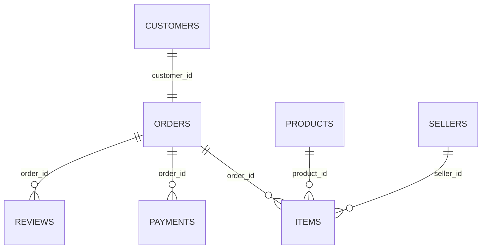

# Olist 数据字典与表关系

数据版本：`0884b628bb036f39`。9 个 CSV 全文件扫描；所有 CSV 先按字符串读取，以下为业务逻辑类型。

金额单位 BRL；邮编前缀保留前导零；时间源未携带时区，不擅自转 UTC。仅报告聚合，不展示原始标识和评价。

## 表关系

customers.customer_id 在当前文件与订单是一对一；customer_unique_id 可对应多个 customer_id，分析客户时使用 customer_unique_id 去重。
翻译表与商品品类是可缺失映射；地理表邮编不唯一，不能作为现成维表直接连接，故不画作一对多约束。
订单可能没有明细、支付或评价，图中为 0..N。所有关系均为观测文件事实，ETL 仍须重新校验。

## orders — `olist_orders_dataset.csv`

粒度：每行一笔订单，状态为抽取时最终状态。共 99,441 行、8 列。
候选键：order_id；完全重复行：0。

| 字段 | 含义 | 逻辑类型 / 单位 | 约束与用途 | 缺失数 | 非空不同值数 |
|---|---|---|---|---:|---:|
| `order_id` | 订单标识 | 字符串 | 保留原始值；连接订单事实表 | 0 (0.00%) | 99,441 |
| `customer_id` | 订单使用的客户记录标识 | 字符串 | 连接 customers；不可直接用于跨订单复购 | 0 (0.00%) | 99,441 |
| `order_status` | 抽取时订单状态 | 枚举字符串 | delivered/shipped/canceled/unavailable/invoiced/processing/created/approved | 0 (0.00%) | 8 |
| `order_purchase_timestamp` | 订单创建时间 | 日期时间，无时区 | 按来源本地时间解释；不要擅自转换 UTC | 0 (0.00%) | 98,875 |
| `order_approved_at` | 订单批准时间 | 日期时间，无时区 | 允许缺失，不等同精确到账流水时间 | 160 (0.16%) | 90,733 |
| `order_delivered_carrier_date` | 移交承运商时间 | 日期时间，无时区 | 允许缺失，需检查先后顺序 | 1,783 (1.79%) | 81,018 |
| `order_delivered_customer_date` | 送达客户时间 | 日期时间，无时区 | 缺失则无法判断交付时长和是否延迟 | 2,965 (2.98%) | 95,664 |
| `order_estimated_delivery_date` | 预计送达日期 | 日期时间，无时区 | 按日比较；预计当天送达不算延迟 | 0 (0.00%) | 459 |

## items — `olist_order_items_dataset.csv`

粒度：每行一个订单商品项，一笔订单可有多项。共 112,650 行、7 列。
候选键：order_id + order_item_id；完全重复行：0。

| 字段 | 含义 | 逻辑类型 / 单位 | 约束与用途 | 缺失数 | 非空不同值数 |
|---|---|---|---|---:|---:|
| `order_id` | 订单标识 | 字符串 | 保留原始值；连接订单事实表 | 0 (0.00%) | 98,666 |
| `order_item_id` | 订单内商品项序号 | 正整数 | 与 order_id 构成联合键；不是商品数量字段 | 0 (0.00%) | 21 |
| `product_id` | 商品标识 | 字符串 | 连接 products | 0 (0.00%) | 32,951 |
| `seller_id` | 卖家标识 | 字符串 | 连接 sellers；同一订单可能涉及多个卖家 | 0 (0.00%) | 3,095 |
| `shipping_limit_date` | 卖家发货期限 | 日期时间，无时区 | 不是客户预计送达日期 | 0 (0.00%) | 93,318 |
| `price` | 商品项销售价格 | 十进制金额 / BRL | 非负、最多两位小数；入库转整数分 | 0 (0.00%) | 5,968 |
| `freight_value` | 商品项分摊运费 | 十进制金额 / BRL | 非负、最多两位小数；不计入本项目商品成交金额 | 0 (0.00%) | 6,999 |

## customers — `olist_customers_dataset.csv`

粒度：每行一个订单使用的客户记录；不是独立自然客户。共 99,441 行、5 列。
候选键：customer_id；完全重复行：0。

| 字段 | 含义 | 逻辑类型 / 单位 | 约束与用途 | 缺失数 | 非空不同值数 |
|---|---|---|---|---:|---:|
| `customer_id` | 订单使用的客户记录标识 | 字符串 | 连接 customers；不可直接用于跨订单复购 | 0 (0.00%) | 99,441 |
| `customer_unique_id` | 跨订单稳定客户标识 | 字符串 | 客户去重、RFM、新老客 | 0 (0.00%) | 96,096 |
| `customer_zip_code_prefix` | 客户邮编前五位 | 五位字符串 | 保留前导零；不要直接连接未聚合地理表 | 0 (0.00%) | 14,994 |
| `customer_city` | 客户所在城市 | 文本 | 命名可能不标准；一版优先州级汇总 | 0 (0.00%) | 4,119 |
| `customer_state` | 客户所在州代码 | 两位字符串 | 州级销售分析使用此字段 | 0 (0.00%) | 27 |

## products — `olist_products_dataset.csv`

粒度：每行一个商品。共 32,951 行、9 列。
候选键：product_id；完全重复行：0。

| 字段 | 含义 | 逻辑类型 / 单位 | 约束与用途 | 缺失数 | 非空不同值数 |
|---|---|---|---|---:|---:|
| `product_id` | 商品标识 | 字符串 | 连接 products | 0 (0.00%) | 32,951 |
| `product_category_name` | 葡语商品品类名称 | 字符串 | 可缺失；与翻译表映射可能不完整 | 610 (1.85%) | 73 |
| `product_name_lenght` | 商品名称长度，原列名拼写如此 | 非负整数 / 字符数 | 只有长度，没有商品名称正文 | 610 (1.85%) | 66 |
| `product_description_lenght` | 商品描述长度，原列名拼写如此 | 非负整数 / 字符数 | 只有长度，没有描述正文 | 610 (1.85%) | 2,960 |
| `product_photos_qty` | 商品图片数量 | 非负整数 / 张 | 不是销售数量 | 610 (1.85%) | 19 |
| `product_weight_g` | 商品重量 | 非负数 / 克 | 保留缺失与零的区别，零值需核查 | 2 (0.01%) | 2,204 |
| `product_length_cm` | 包装长 | 非负数 / 厘米 | 保留缺失；不是商品销量 | 2 (0.01%) | 99 |
| `product_height_cm` | 包装高 | 非负数 / 厘米 | 保留缺失 | 2 (0.01%) | 102 |
| `product_width_cm` | 包装宽 | 非负数 / 厘米 | 保留缺失 | 2 (0.01%) | 95 |

## sellers — `olist_sellers_dataset.csv`

粒度：每行一个卖家；不是平台店铺访问日志。共 3,095 行、4 列。
候选键：seller_id；完全重复行：0。

| 字段 | 含义 | 逻辑类型 / 单位 | 约束与用途 | 缺失数 | 非空不同值数 |
|---|---|---|---|---:|---:|
| `seller_id` | 卖家标识 | 字符串 | 连接 sellers；同一订单可能涉及多个卖家 | 0 (0.00%) | 3,095 |
| `seller_zip_code_prefix` | 卖家邮编前五位 | 五位字符串 | 保留前导零 | 0 (0.00%) | 2,246 |
| `seller_city` | 卖家城市 | 文本 | 不是客户城市 | 0 (0.00%) | 611 |
| `seller_state` | 卖家州代码 | 两位字符串 | 卖家侧地区属性 | 0 (0.00%) | 23 |

## payments — `olist_order_payments_dataset.csv`

粒度：每行一笔订单的支付序号记录；一单可多次支付。共 103,886 行、5 列。
候选键：order_id + payment_sequential；完全重复行：0。

| 字段 | 含义 | 逻辑类型 / 单位 | 约束与用途 | 缺失数 | 非空不同值数 |
|---|---|---|---|---:|---:|
| `order_id` | 订单标识 | 字符串 | 保留原始值；连接订单事实表 | 0 (0.00%) | 99,440 |
| `payment_sequential` | 订单内支付序号 | 正整数 | 与 order_id 构成联合键 | 0 (0.00%) | 29 |
| `payment_type` | 支付方式 | 枚举字符串 | credit_card/boleto/voucher/debit_card/not_defined | 0 (0.00%) | 5 |
| `payment_installments` | 分期数 | 非负整数 / 期 | 可观测到 0；不要与支付记录条数混淆 | 0 (0.00%) | 24 |
| `payment_value` | 支付记录金额 | 十进制金额 / BRL | 非负、两位小数；不直接当作商品成交金额 | 0 (0.00%) | 29,077 |

## reviews — `olist_order_reviews_dataset.csv`

粒度：每行一条评价记录；订单与 review_id 均不能先验当作唯一键。共 99,224 行、7 列。
候选键：不假设唯一键，参见审计报告；完全重复行：0。

| 字段 | 含义 | 逻辑类型 / 单位 | 约束与用途 | 缺失数 | 非空不同值数 |
|---|---|---|---|---:|---:|
| `review_id` | 评价标识 | 字符串 | 须审计唯一性；可能跨订单重复 | 0 (0.00%) | 98,410 |
| `order_id` | 订单标识 | 字符串 | 保留原始值；连接订单事实表 | 0 (0.00%) | 98,673 |
| `review_score` | 订单评分 | 整数 / 星 | 1–5；缺失不记为 0 | 0 (0.00%) | 5 |
| `review_comment_title` | 评价标题 | 可空文本 | 缺少标题不等于缺少评分；不输出原文 | 87,658 (88.34%) | 4,526 |
| `review_comment_message` | 评价正文 | 可空文本 | 可能包含自由文本信息；不纳入公开审计明细 | 58,274 (58.73%) | 36,155 |
| `review_creation_date` | 评价调查创建日期 | 日期时间，无时区 | 不同于回答时间 | 0 (0.00%) | 636 |
| `review_answer_timestamp` | 评价回答时间 | 日期时间，无时区 | 若取最近评价，以此排序并使用确定性并列规则 | 0 (0.00%) | 98,248 |

## geolocation — `olist_geolocation_dataset.csv`

粒度：每行一个邮编前缀对应的地理记录；邮编不是唯一键。共 1,000,163 行、5 列。
候选键：不假设唯一键，参见审计报告；完全重复行：261,831。

| 字段 | 含义 | 逻辑类型 / 单位 | 约束与用途 | 缺失数 | 非空不同值数 |
|---|---|---|---|---:|---:|
| `geolocation_zip_code_prefix` | 地理记录邮编前缀 | 五位字符串 | 非唯一，先聚合再用于维表连接 | 0 (0.00%) | 19,015 |
| `geolocation_lat` | 纬度 | 数值 / 度 | 有效范围 [-90,90]；合法坐标不等于业务合理 | 0 (0.00%) | 717,372 |
| `geolocation_lng` | 经度 | 数值 / 度 | 有效范围 [-180,180]；州级分析无需使用 | 0 (0.00%) | 717,615 |
| `geolocation_city` | 地理记录城市名 | 文本 | 同一邮编可能有多种拼写 | 0 (0.00%) | 8,011 |
| `geolocation_state` | 地理记录州代码 | 两位字符串 | 同一邮编可能关联多州，需要另行处理 | 0 (0.00%) | 27 |

## translation — `product_category_name_translation.csv`

粒度：每行一个葡语品类到英语名称的映射。共 71 行、2 列。
候选键：product_category_name；完全重复行：0。

| 字段 | 含义 | 逻辑类型 / 单位 | 约束与用途 | 缺失数 | 非空不同值数 |
|---|---|---|---|---:|---:|
| `product_category_name` | 葡语商品品类名称 | 字符串 | 可缺失；与翻译表映射可能不完整 | 0 (0.00%) | 71 |
| `product_category_name_english` | 英语品类名称 | 字符串 | 展示用；不替代原始品类键 | 0 (0.00%) | 71 |

## 关联策略

1. 明细先汇总成订单金额，支付先按订单汇总，评价先明确保留规则，再连接订单事实。
2. 若按品类筛选，金额仅累加命中明细，订单数使用命中订单去重；不同品类订单数可能重叠，不能简单相加。
3. 一版地区分析直接使用 customer_state；不需要接入百万行地理表。
4. review_id 非唯一不等于可随意去重。暂保留全部原始评价；未来服务层按回答时间取最近一条，并记录并列规则与折叠数量。
