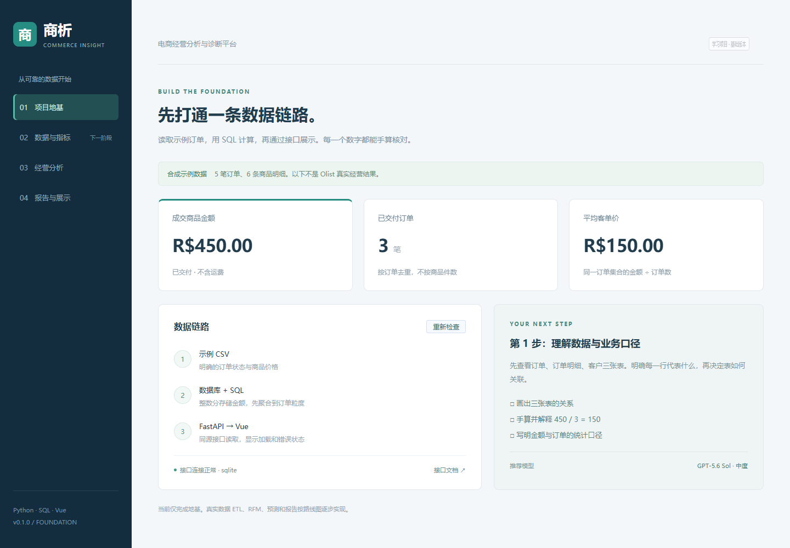
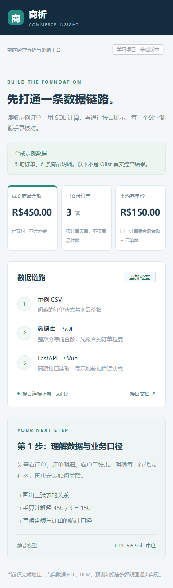

# 分阶段验证记录

最新阶段：[客户分析](customers/VERIFICATION.md)、[经营报告](reports/VERIFICATION.md)。

第 2–4 周真实 ETL 与核心版本的最新执行证据见 [core/VERIFICATION.md](core/VERIFICATION.md)。以下保留此前阶段记录，其“尚未实现”指当时状态。

## 第 1 周追加验证（2026-09-19）

- 新增审计脚本与 5 项审计测试；连同既有地基测试共 **15 passed**，仍有一条既有依赖弃用提示。
- 使用标准库 CSV 独立核对 9 个文件、52 个表字段的缺失计数、已交付订单数与商品金额；结果见 [verification.json](audit/verification.json)。
- 对原始文件逐一核对 SHA-256，版本 `0884b628bb036f39`，未改动原始数据。
- 金额核对值：96,478 笔已交付订单，110,197 条命中商品项，1,322,149,811 分（BRL）。
- 原始数据、预检查临时文件和本地数据库仍被 Git 忽略。
- 本阶段没有修改页面/业务接口，不重跑无关前端构建；没有真实 ETL、MySQL 容器或远程发布验收。
- 审计方法来源与许可引用记录在 DATA_AUDIT.md 和 DATA_SOURCE.md。

以下保留地基阶段的历史验证，不代表上述未完成项已通过。

执行日期：2026-09-17。范围仅限当前 v0.1 基础链路。

| 检查 | 实际结果 |
|---|---|
| Python 测试 | 10 passed；覆盖金额、订单去重、幂等导入、空数据、5 类错误输入、接口和未初始化数据库 |
| 前端构建 | Vite 6.4.1 构建成功，入口 JS 约 118 KB（gzip 约 46 KB） |
| 样例导入 | 5 笔订单、6 条明细 |
| 实际 HTTP 接口 | 健康检查 ok；订单 3；金额 45000 分；客单价 15000 分 |
| 桌面浏览器 | Edge 无头验证通过，1440 × 1000 |
| 手机宽度 | 390 × 844 验证通过，无水平溢出 |
| 页面交互 | 刷新、503 错误、清除旧指标、恢复加载均通过 |
| 浏览器运行错误 | 0 个 pageerror |
| Git 忽略规则 | 原始数据、数据库、.env、node_modules 和 dist 均被忽略 |

测试环境：Windows，Python 3.10，Node.js 24.16.0，SQLite。
后端测试出现一条 Starlette/AnyIO 的弃用提示，不影响当前结果，后续依赖升级时处理。

尚未验证：MySQL 运行、Docker 构建和 Compose 启动、GitHub Actions 云端执行、在线发布。
当前没有远程仓库；没有执行 Git 提交或推送。真实 Olist CSV 已下载但没有运行真实 ETL。

## 页面截图

