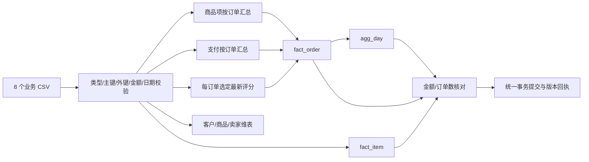

# 第 2 周：分析表与导入规则

目标：原始文件可重复导入；事实表、汇总表与原始金额和订单数一致；查询不因支付或评价行数放大金额。
实现与既有 `demo_orders`、`demo_items` 分离；合成数据只保留为教学样例。

## 表的粒度

| 表 | 每行代表什么 | 主键 / 关键字段 |
|---|---|---|
| dim_customer | 订单使用的客户记录 | customer_id；跨订单身份 customer_unique_id；客户州 state |
| dim_product | 商品 | product_id；原始品类 category；可空英语名 category_english |
| dim_seller | 卖家 | seller_id；卖家州 state |
| fact_order | 原始订单，包括非已交付状态 | order_id；下单/配送日期、整单商品金额、运费、支付汇总、选定评分、质量标记 |
| fact_item | 订单商品项 | (order_id,item_id)；product_id、seller_id、商品金额和运费 |
| agg_day | 已交付订单按下单日汇总 | day；商品金额、订单数、商品项数 |
| etl_run | 当前已提交的数据版本回执 | id=1；版本、输入指纹、导入时间、行数、质量计数和核对结果 |

金额为 BIGINT 整数分，数据库连接支持 MySQL 8.0 与 SQLite。外键约束与主键在分析表显式定义；MySQL 使用 InnoDB。
交易时间按来源无时区字符串固定为 YYYY-MM-DD HH:MM:SS，另存 purchase_date 便于日期筛选；不擅自转换时区。
当前全量刷新适合约 10 万笔订单。没有声称实现 CDC、实时数据流或任意规模的增量处理。



## 导入过程

1. 只读读取订单、商品项、客户、商品、卖家、支付、评价、品类翻译 8 个 CSV；地理表暂不接入查询。
2. 验证完整 CSV 结构、主键、关联键、允许的状态、日期、非负金额和整数序号；非法值失败，不跳过坏行。
3. 在内存中完成分别聚合，金额用 Decimal 转分；支付缺失保留 null；评价按回答时间、创建时间、review_id、输入行序确定最后一条，并记录折叠数量。
4. 建表放在刷新事务之外，避免 MySQL DDL 隐式提交破坏原子性；刷新使用 DELETE + INSERT，按外键顺序进行，不 DROP 表。
5. 在同一写事务中核对原始商品金额、运费、支付汇总、订单数及日汇总；再次验证源文件 SHA-256 未变。
6. 仅当校验均通过才提交。失败时回滚数据写入；首次建表失败/数据校验失败可能留下空结构，但不会把半套数据当作已导入版本。

相同源文件重跑是有意的全量替换，不按“再插一次”累加。导入时间允许改变，业务行数、金额和数据版本应一致。
当前只支持一个受控导入作业；不要同时运行多个导入命令。API 使用一个一致性读事务读取本次响应，避免跨两次提交混合指标。

## 第 1 周问题如何处理

| 问题 | 处理 |
|---|---|
| 已交付缺少支付 | 保留订单和商品金额，payment_cents=null，payment_count=0，添加标记 |
| 已交付缺送达日期 | 销售保留，delivery_seconds/is_late=null，相应履约分母排除 |
| 承运早于下单 / 送达早于承运 | 保留原值并标记，不因此删除商品销售；有效的下单→送达总时长仍可用 |
| 送达早于下单 | 保留销售并标记，交付时长与延迟判断不可用 |
| 品类缺失 / 翻译缺失 | 品类填显式 unknown；无翻译时显示原品类，不丢商品 |
| 多支付 / 多评价 | 先各自处理到订单粒度后关联，不与商品项做原始多对多连接 |
| 支付与商品加运费不同 | 记录差额标记，不把它解释为退款、利润或修正商品金额 |
| 缺少评价 | review_score=null、review_count=0；不当作 0 分 |

分析表不保存评价正文、客户姓名或精确坐标。

## 复现与证据

```bash
python -m backend.etl data/raw
python -m backend.etl data/raw
python -m pytest -q
python -m scripts.verify_pipeline
```

设置 DATABASE_URL 可选择 MySQL；不设置时用于本地开发的 SQLite 存在 data/ 中。生产或部署首选 MySQL。
`verify_pipeline` 需要对应 API 已启动，会从原始 CSV 独立计算，再比较 SQL 仓库与 HTTP 接口。
第 1 周审计版本覆盖 9 个文件，ETL 版本覆盖 8 个实际输入文件；两个版本摘要不必相同，必须通过文件名＋完整 SHA-256 核对共同输入。
实际执行结果见本轮 `docs/core/VERIFICATION.md`，不要把上述命令示例当作已通过证据。
