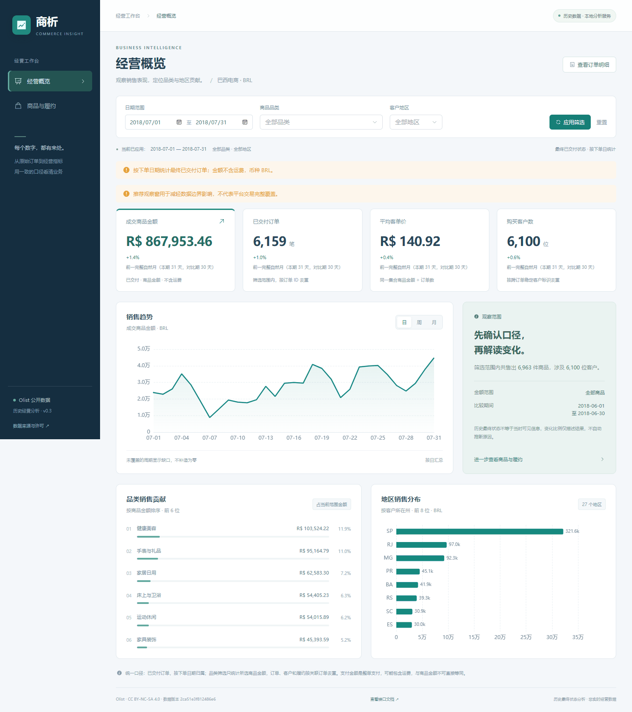
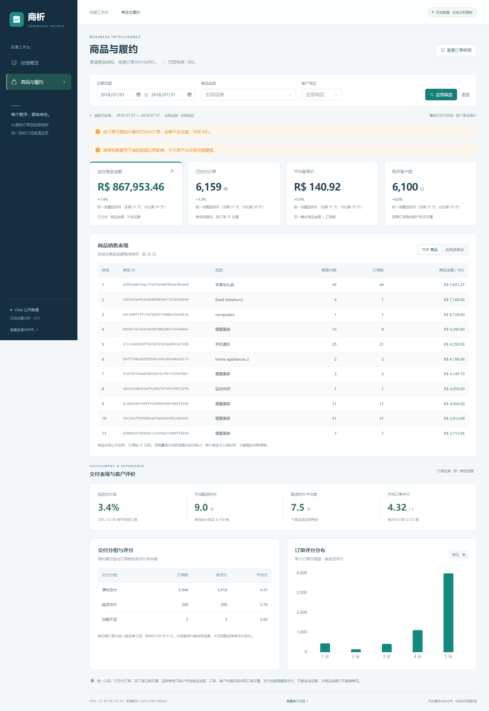

# 第 2–4 周核心版本验收

执行日期：2026-09-19。范围：真实 ETL、分析表/日汇总、核心只读接口、经营概览、商品与履约、筛选与订单详情。客户分群、业务案例、自动报告、预测和远程发布不在本次验收中。

## 执行结果

| 检查 | 实际结果与证据 |
|---|---|
| Python 测试 | `python -m pytest -q`：45 passed，1 条现有 Starlette/AnyIO 弃用提示，3.40 秒 |
| 前端生产构建 | `npm run build` 成功；主 JS 886.52 KB，gzip 302.94 KB；保留大于 500 KB 的包体提醒 |
| MySQL 全量导入与重跑 | 原生 MySQL 8.0.41 连续导入两次，所有业务表行数、金额、输入版本一致；[回执](etl_receipt.json)、[两次记录](etl_idempotence.json) |
| 原始 CSV → SQL → HTTP | 6 组独立核对，整数分和数量精确一致；[结果](acceptance.json) |
| 周/月趋势与履约 | 7 月、全量两范围 × 周/月，共 4 个请求，每个周期与原始文件独立结果一致；[结果](detail_acceptance.json) |
| SQLite 入门路径 | 同一原始数据完整导入，7 月指标与 MySQL 一致；[结果](sqlite_acceptance.json) |
| 浏览器 | Edge，1440×1000 桌面及 390×844 手机宽度；两页、筛选、趋势粒度、订单翻页及详情、错误恢复通过；[结果](browser_acceptance.json) |
| 空值与错误 | 空观察窗、无交集窗口、空筛选、缺支付/配送/评分、非法日期、404/422/503 均有验证 |
| 页面一致性 | 默认 7 月及品类＋SP 的金额与订单数和独立证据相符；未应用筛选不改变结果，失败后不残留旧 KPI |
| 布局与运行错误 | 手机页面无整体水平溢出；宽表局部左右滑动；浏览器 pageerror 为 0；截图已目视检查 |

测试环境：Windows、Python 3.10、Node.js 24.16.0、Vite 6.4.1、MySQL 8.0.41 / SQLite。MySQL 在本任务专用实例和数据库中运行，API 验收使用只读账户；未改动已有个人 MySQL 服务。

## 核对数字

| 范围 | 原始/命中商品项 | 已交付订单 | 成交商品金额（BRL） | 购买客户 |
|---|---:|---:|---:|---:|
| 全量已交付 | 110,197 | 96,478 | 13,221,498.11 | 93,358 |
| 2018 年 7 月 | 6,963 | 6,159 | 867,953.46 | 6,100 |
| 7 月床上与卫浴、客户州 SP | 318 | 262 | 27,106.04 | 262 |

全部原始订单为 99,441，全部商品项 112,650；未交付状态仍保存在 fact_order 中，但不进入主经营口径。
全量已交付有 8 笔缺送达日期，延迟率有效分母为 96,470，延迟 6,534，有评价 95,832；销售金额不因这些缺失而减少。

金额与计数核对必须精确相等。MySQL 平均评分有四位小数精度，独立脚本容许绝对误差 0.000051，其他容差及证据在脚本中公开。
ETL 版本 `2ca51e3f812486e6` 覆盖 8 个输入；第 1 周版本覆盖 9 个文件，已按文件名和 SHA-256 核对共同输入。

## 覆盖了哪些关键错误

- 5 笔可手算样例同时包含多商品、多支付、多评价、重复评价 ID、取消和处理中订单；验证金额不因关联相乘。
- 重复导入、非法金额、重复键、孤立关联、源文件变化、写入/核对异常时回滚，保留此前有效数据；demo_ 表不受真实 ETL 刷新影响。
- 缺日期、缺支付、缺评价分别影响相关指标；评价选择规则有确定的并列顺序。
- 日期首尾包含，周一/自然月分组，首尾不完整周期，空分母和推荐覆盖不足；空观察窗及推荐窗口前后的数据均不会触发 500。
- 筛选使用参数绑定；购买客户按 customer_unique_id；订单分页和详情遵守同一品类金额口径。
- 读事务快照避免一个响应内混合版本；SQLite 测试覆盖并发提交时的读取一致性。未声称进行并发压力测试。

## 复现

按照 README 取得数据并安装依赖、设置对应数据库，先导入，再启动 API 与前端。

```bash
python -m backend.etl data/raw
python -m backend.etl data/raw
python -m pytest -q
python -m scripts.verify_pipeline --api-url http://127.0.0.1:8000
python -m scripts.verify_core_details --api-url http://127.0.0.1:8000
```

后两条脚本要求当前公开 Olist 文件和稳定的已导入版本。`verify_pipeline` 的 DATABASE_URL 必须与 API 一致；`verify_core_details` 只读取 CSV 和 HTTP，不复用业务指标函数。

浏览器手动复查：7 月默认金额 867,953.46 → 日/周/月切换 → 床上与卫浴＋SP 筛选 → 金额 27,106.04、262 单 → 打开订单、翻页、查看商品项 → 商品与履约页查看分母与评分 → 缩窄至手机宽度。

## 已知限制

- Docker 未安装，因此 Compose、容器构建未实测；这不等于原生 MySQL 未验证。GitHub Actions 云端运行及在线发布尚未执行，当前没有远程仓库。
- 目前全量刷新、单个导入任务；未实现增量 ETL、迁移框架、访问权限系统或并发导入锁。接口仅提供本地只读演示。
- 这是约 10 万订单的学习原型。当前一次本机 7 月查询约 1.37 秒，全历史约 20.56 秒；这些不是性能基准或 SLA，未做负载测试。更多历史维度查询可在后续优化 SQL 和汇总策略。
- 前端主包仍有体积提醒，按路由拆包可在发布阶段处理；当前构建成功且实际页面可用。
- 数据是历史公开抽样，推荐窗口无法证明平台覆盖完整；没有真实库存、利润或退款数据，不推断这些指标，也不声称经营建议已带来收益。

## 页面截图





手机截图：[经营概览](overview-mobile.png)、[商品与履约](products-mobile.png)。
