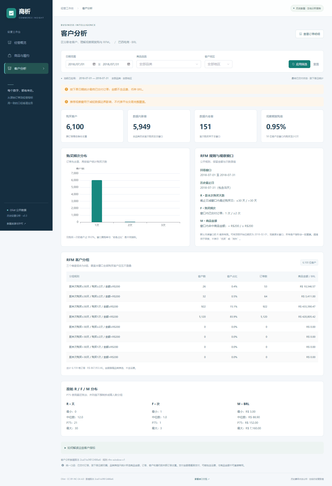

# 第 5 步客户分析验收

执行日期：2026-09-22。仅完成客户分析开工清单，没有实施后续业务案例、异常提示、自动报告、预测或发布。

| 检查 | 实际结果 |
|---|---|
| 后端全套测试 | 56 passed，1 条已有 Starlette/AnyIO 弃用提示；其中客户功能新增11项 |
| 前端构建 | 成功，6.97秒；主 JS 893.90KB、gzip 305.26KB；仍有大于500KB的包体提醒 |
| 原始 CSV → MySQL HTTP | 6组窗口/维度逐项核对 summary、频次、R/F/M分布、8组人数/订单/金额，全部一致；[证据](acceptance.json) |
| SQLite 真实数据 | 同样6组的 summary、distribution、segments、frequency_distribution 与上述独立核对结果全部一致 |
| 客户页浏览器 | Edge，桌面1440×1000、手机390×844，均通过；[证据](browser.json) |
| 原有两页回归 | 概览、商品履约、日周月切换、筛选、订单翻页/详情、错误恢复、空日期范围及手机布局通过；[证据](core-regression/browser_acceptance.json) |

## 核对范围

2018年7月、2018年2–7月、2017年1月至2018年7月、7月床上与卫浴＋SP、7月2日＋RJ、无匹配地区XX。整数金额和计数精确一致，分群金额与订单合计守恒。
原始数据核对脚本使用标准库 CSV、Decimal、日期运算及HTTP，不调用客户业务聚合函数。输入指纹与当前 ETL 回执逐一匹配，输出不包含客户或订单标识。

7月实际结果：6,100位购买客户，5,949位数据内新客，151位老客，58位窗口内复购客户，复购率58/6100≈0.9508%，页面显示0.95%。新老客划分与复购划分不是同一件事。

## 边界与页面检查

- 手算样例覆盖稳定客户的多个订单客户ID、多商品、多支付、多评价及非已交付订单。
- 首次购买在当前品类和地区之外，仍会正确识别为老客；同一客户跨州的分组计数不可相加。
- 增加截止日之后的订单，不改变历史窗口的R/F/M和新老客结果。
- R=30/31、F=1/2、M=19999/20000分边界准确；全零/并列金额、空集合、非法日期、过长参数、未导入数据库有测试。
- 页面默认值与独立证据一致；较长窗口有R>30组；品类和地区筛选生效；未应用的草稿不改变结果。
- 客户接口503时清除旧卡片，重试恢复；无客户时复购率显示不可计算。
- 延迟返回旧请求并快速重置筛选，旧结果不能覆盖新结果；浏览器运行异常为0。
- 两个尺寸的截图已目视检查，手机导航不换行溢出；宽分组表在局部横向滚动，页面整体无水平溢出。

## 复现与限制

按 README 启动真实数据后端和前端后：

```bash
python -m pytest -q
python -m scripts.verify_customers --api-url http://127.0.0.1:8000
```

前端目录执行 `npm run build`。手动进入客户分析，核对默认4项卡片，扩大开始日期到2018-02-01，再添加品类及地区筛选。

RFM规则见 [CUSTOMER_ANALYSIS.md](../CUSTOMER_ANALYSIS.md)。本版复用页面同一回看窗口，未购买的历史客户不纳入分群；默认月度窗口R全部≤30。阈值为透明的探索规则，未通过收益实验或预测效果验证，不能用于宣称客户价值提升。
未实施独立RFM回看控件、客户级明细、并发压力测试或部署。本次没有变更ETL或数据库结构；旧验收记录保持独立。Docker未实测，GitHub未发布。

## 页面截图



[客户分析手机截图](mobile.png)。
