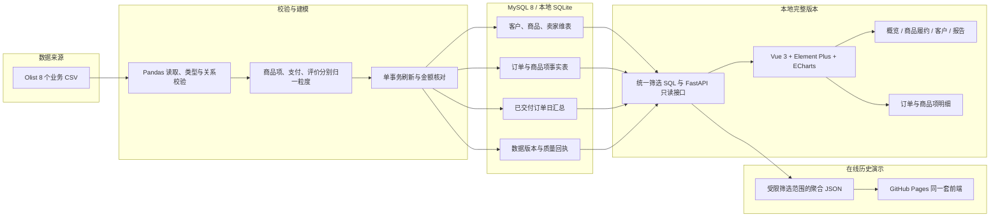

# 项目架构与设计取舍

本图描述本地完整分析链路，以及供 GitHub Pages 使用的聚合快照链路。在线演示只展示预先导出的历史结果；订单明细查询属于本地 FastAPI 版本。

## 为什么这样设计

| 决策 | 解决的问题 | 实际边界 |
|---|---|---|
| 订单、商品项分别建事实表 | 一笔订单有多件商品，金额可加、订单数必须去重 | 品类订单数跨类不可相加 |
| 支付先按订单汇总，评价先选定订单级记录 | 避免商品 × 支付 × 评价的多对多连接放大金额 | 支付金额与商品金额含义不同，不拿支付代替成交商品金额 |
| 金额以整数分保存 | 保持导入、SQL 和接口的金额精确核对 | 展示客单价时可出现小数分 |
| 先独立审计，再事务导入并保存版本回执 | 重跑可复现，校验失败不会留下半套有效数据 | 当前是单作业全量刷新，不是实时或增量管道 |
| API 只读，页面共用日期、品类、客户州口径 | 四个页面能在同一分析范围内对照 | 不提供账户、多租户或实时查询 |
| 静态演示只发布聚合快照 | 无需服务器即可让招聘方打开页面，避免公开原始订单 | 只能选择已导出的范围；不提供在线订单明细 |

**主指标集合**：最终状态为已交付的订单，按下单日归属；成交金额为匹配商品项 `price` 之和，单位 BRL、不含运费。客户用跨订单稳定标识识别。最终状态是历史回看结果，不能解释为当天下单时已经知道订单将交付。完整定义见 [指标口径](../METRICS.md)。

**核对链**：原始 CSV → 分析表及日汇总 → SQL/API → 页面或静态 JSON。全量导入的 99,441 笔原始订单、112,650 条明细、96,478 笔最终已交付订单和 R$ 13,221,498.11 已交付商品金额见[核心验收记录](../core/VERIFICATION.md)；报告与原始 CSV 的独立核对见[报告验收](../reports/VERIFICATION.md)。静态快照与 API 的 30 份响应核对见[静态验收](../pages/VERIFICATION.md)，线上发布见[公开发布验收](../RELEASE_VERIFICATION.md)。

Olist 公开数据由 Olist 发布，许可 [CC BY-NC-SA 4.0](https://creativecommons.org/licenses/by-nc-sa/4.0/)；项目进行了清洗、聚合与解释，未修改源文件。来源和复现方式见 [数据来源](../DATA_SOURCE.md)。
