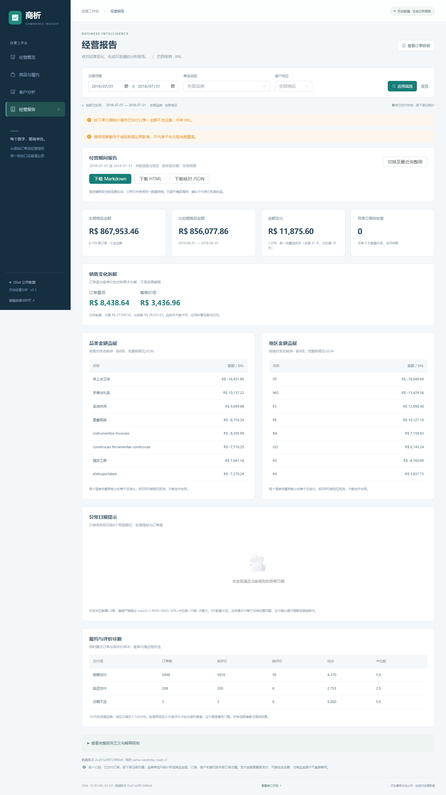

# 第 6 步：经营诊断与报告验收

执行日期：2026-09-22。完成两份业务案例、经营报告第四页、异常规则、Markdown/HTML/JSON导出；未推进部署、静态发布、定时发送或预测。

| 检查 | 结果 |
|---|---|
| 全套后端测试 | 64 passed，11.54秒；1条已有Starlette/AnyIO弃用提示；报告新增8项测试 |
| 前端构建 | 成功，6.71秒；主JS 902.92KB，gzip 307.96KB；仍有大于500KB的包体提醒 |
| 原始文件独立核对 | 6组报告的指标、比较期、贡献、履约分布、品类/地区分层、每日异常判断全部通过；[证据](acceptance.json) |
| SQLite/MySQL一致性 | SQLite导出的7月案例与实际MySQL HTTP结果一致，包括拆解、全部贡献、异常及履约分层 |
| 报告浏览器 | Edge，1440×1000桌面及390×844手机；月报、完整周预设、真实异常周、数据不足、错误清理/恢复通过；[证据](browser.json) |
| 下载 | Markdown、HTML文件内容逐字等于页面响应中的正文；JSON数据版本一致，文件名保留分析日期 |
| 独立HTML | 本地打开实际HTML周报成功，表格、中文与段落已截图目视检查；动态字段均转义 |
| 旧功能回归 | [概览和商品履约](core-regression/browser_acceptance.json)、[客户分析](customer-regression/browser.json)均通过，包括筛选、分页、详情、空状态、错误恢复及旧请求丢弃 |

浏览器运行错误为0，手机页面无整体水平溢出，宽表可在局部滚动。没有修改原始文件、ETL或数据库结构。

## 六组核对范围

1. 2018年7月：与完整6月比较，包含月份天数差。
2. 2018-07-23至07-29：周报与前一周，未触发当前异常规则。
3. 2017-11-20至11-26：4天触发偏高；11月24日1,147单，历史中位数134，阈值71.1648。
4. 7月床上与卫浴＋SP：验证维度筛选、商品项金额和订单去重。
5. 无匹配州XX：零订单、零分母和历史稀疏，不伪造可用指标。
6. 2017-01-01至01-07：推荐窗口起点缺8周基线，不判异常，不计算覆盖不足的比较期。

独立脚本从5个原始CSV重建订单、商品、客户、品类和规范评价，使用Decimal计金额，不调用报告业务函数。逐个日期核对8个历史同星期基线、覆盖、阈值与状态；检查输入SHA-256在计算前后不变且与ETL回执一致。输出只有聚合，无客户或订单标识。

## 关键边界

- 手算测试证明对称拆解金额守恒，新增/消失品类进入贡献并集，任一期无订单不计算客单价拆解。
- 修改未来日期订单量不影响目标日基线；基线不包含目标日；偏差刚好等于阈值不触发；MAD为0仍有绝对和相对下限。
- 缺历史、覆盖外、基线中位数小于5均标数据不足。无提示不是“经营正常”的保证。
- 履约先按订单唯一主品类归组，避免多品类重复计算；缺评价、缺交付日期单独保留。分层至少20条评价是展示门槛，不是显著性结论。
- 输出记录期间、筛选、数据版本、规则与来源许可。非完整自然周不称周报；建议另列为尚未执行。
- HTML对动态文本转义，测试输入含script标签也不能成为可执行HTML。参数无效返回422，仓库未就绪返回503。

## 两份案例的证据边界

[销售变化](CASE_SALES.md)：7月总额+1.39%，日均-1.88%；没有把总额增长直接当作经营改善。
[履约评价](CASE_DELIVERY.md)：评分均值差、分布、缺失及结构差异都公开；没有显著性或因果收益声明，也没有已实施试点的声明。

## 复现

API需指向已导入的真实仓库；脚本使用当前ETL回执校验源版本：

```bash
python -m pytest -q
python -m scripts.verify_reports --api-url http://127.0.0.1:8000
python -m scripts.export_report --output reports
```

前端目录执行 `npm run build`。打开“经营报告”，切换完整周并下载三种文件；异常样例日期使用2017-11-20至11-26。
历史最终状态不能代表当时可见信息，本功能不声称实时预警回测。阈值未校准误报率，未做性能压力测试。Docker、GitHub Actions云端执行与远程发布仍未验收。

## 截图



[手机异常周截图](mobile.png) · [HTML样例预览](html-preview.png)。
